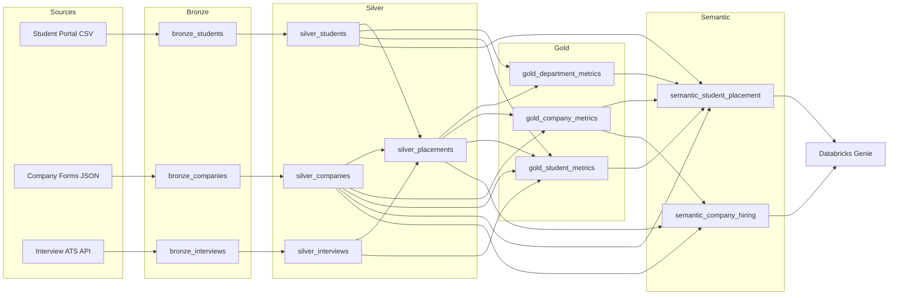
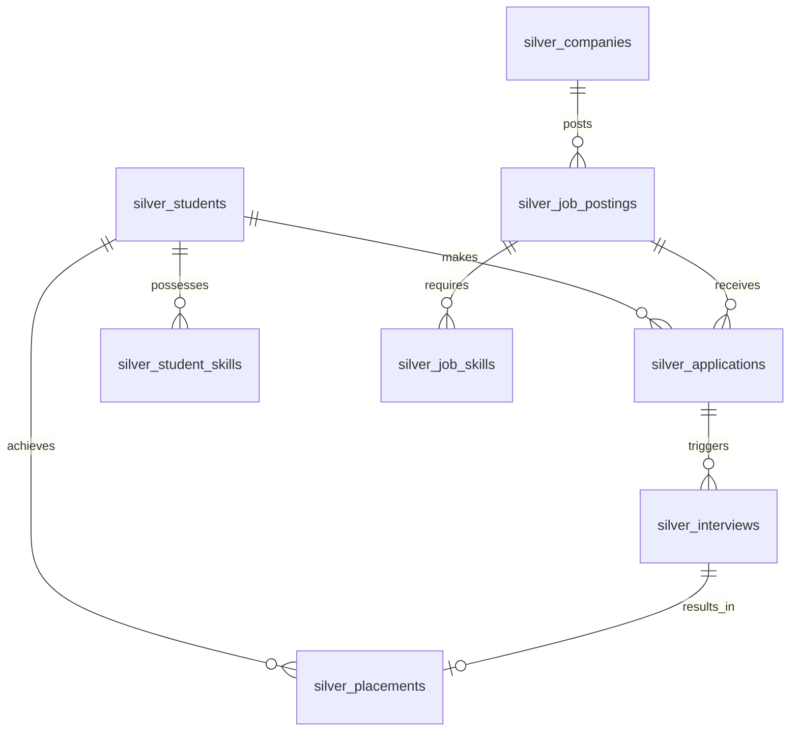

# Architecture

## Overview
Placewise utilizes a Medallion Architecture on Databricks Unity Catalog, implemented primarily via dbt. Data flows from raw files (CSV/JSON) into Bronze, is cleansed into Silver, aggregated into Gold, and finally exposed via a Semantic layer tailored for Databricks Genie.

## Medallion Architecture
- **Bronze:** Raw, ingested data with minimal schema enforcement. Append-only or full overwrite depending on source.
- **Silver:** Cleansed, conformed dimensions and facts. Enforces data types, constraints, and relationships.
- **Gold:** Business-level aggregates (e.g., department performance, company hiring trends).
- **Semantic:** Flattened, user-friendly views designed specifically for Genie natural language querying.

## Data Lineage

## Entity-Relationship Diagram (Silver Layer)

## Key Design Decisions
1. **Bridge Tables for Skills/Departments:** `job_posting_departments` is a bridge table rather than an array column in `job_postings` to simplify Genie querying and standard SQL joins. Array explosion is often difficult for LLM-based query generation.
2. **Semantic Layer Flattening:** The Semantic layer deliberately denormalizes certain Gold/Silver tables to avoid Genie having to infer complex join paths across 5+ tables.
3. **Data Quality Quarantine:** Bad records in Silver load are routed to a quarantine table (`silver_quarantine`) rather than failing the pipeline, ensuring partial data availability.

## Deployment Notes
- Unity Catalog is required.
- Schemas: `placewise_bronze`, `placewise_silver`, `placewise_gold`, `placewise_semantic`.

## Assumptions
- Student IDs and Company IDs are persistent across academic years.
- Package values are strictly in LPA (Lakhs Per Annum) for consistency.
