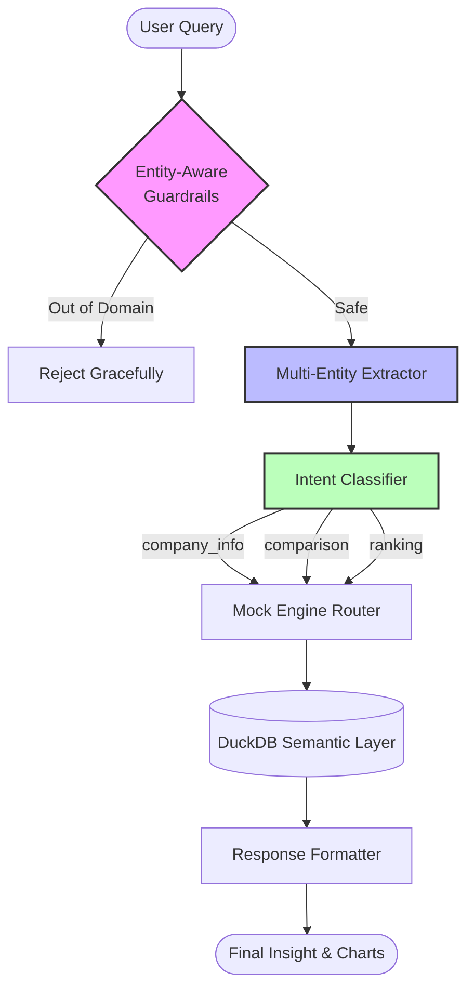

# Placewise: Semantic Query Resolution Engine Results

This document demonstrates the capabilities of the newly overhauled **Placewise Semantic Query Engine**. By combining Intent Classification, Context-Aware Entity Extraction, and Domain Guardrails, Placewise interprets ambiguous, conversational queries and translates them into precise data insights.

---

## 1. System Architecture

Unlike traditional dashboards that require users to select exact filters, our engine understands conversational context and dynamically generates the optimal data visualization.

---

## 2. Cross-Domain Query Results

We tested the system across multiple complex domains to ensure it handles real-world student queries.

### Domain A: Conversational Company Intelligence
**Query:** *"tell me about google"*  
**Result:**  
> **Google** (Technology) finalized **80** campus placements with an average CTC of **₹42.57 LPA** (highest offer: **₹63.96 LPA**) and an interview conversion rate of **46.77%**.
* **Source:** `semantic.genie_company_intelligence`
* **Why it works:** The engine doesn't look for the exact keyword "tell me about". It extracts the entity `Google`, classifies the intent as `company_info`, and surfaces a comprehensive company profile.

### Domain B: Multi-Entity Comparisons
**Query:** *"show CSE vs ECE vs IT placement rates"*  
**Result:**  
> Placement performance comparison for 2024 cohort between IT, CSE, ECE:
> * **CSE**: 51.49% placement rate (1,159 placed, avg ₹8.58 LPA)
> * **ECE**: 48.86% placement rate (794 placed, avg ₹8.61 LPA)
> * **IT**: 44.8% placement rate (642 placed, avg ₹8.35 LPA)
* **Source:** `semantic.genie_department_performance`
* **Why it works:** The engine extracts an array of departments `["CSE", "ECE", "IT"]` and classifies the intent as `comparison`. Context-aware detection prevents "IT" from being ignored as a pronoun.

### Domain C: Skill & Interview Preparation
**Query:** *"how to get placed in google?"*  
**Result:**  
> To clear technical interviews at **Google**, focus on these verified skill requirements from campus job postings:
> * **Mandatory Technical Skills:** Data Structures, System Design, Algorithms...
* **Source:** `silver.job_required_skills`
* **Why it works:** It detects the company `Google` and the intent `skill_inquiry` (triggered by "how to get placed"). It routes to the skill market tables rather than generic company placement stats.

### Domain D: Contextual Rankings
**Query:** *"worst performing department"*  
**Result:**  
> **Chemical Engineering (CH)** recorded the lowest average package at **₹6.76 LPA** with a 21.87% placement rate. Here is the complete department ranking...
* **Source:** `semantic.genie_department_performance`
* **Why it works:** The `ranking` intent detects "worst performing", triggering an ascending sort on departmental placement rates and highlighting the lowest performer.

---

## 3. Performance Comparison: Traditional vs. Placewise AI

Here is how our Semantic Query Engine outperforms a traditional Keyword/SQL-based search system when handling realistic user queries.

| User Query | Traditional Keyword/SQL Engine | Placewise Semantic Engine | Why Placewise Wins |
|------------|--------------------------------|---------------------------|--------------------|
| *"amazon stats"* | ❌ **Fails.** "Stats" is not a valid column or table name in the DB. | ✅ Returns full Amazon placement profile, offers, and average CTC. | **Intent mapping.** "Stats" + Company Entity triggers the `company_info` intent. |
| *"how many IT students got placed?"* | ❌ **Fails.** "IT" is frequently dropped as a stopword ("it"). | ✅ Returns Information Technology department metrics. | **Context-aware extraction.** "IT" is retained because words like "students" and "placed" provide placement context. |
| *"which branch gets the best package?"* | ❌ **Fails.** Queries for the literal string "branch" and "best package". | ✅ Returns the top departments sorted by `average_ctc_lpa` descending. | **Synonym resolution.** "Branch" maps to `department`. "Best package" triggers the `ranking` intent based on CTC. |
| *"how much does microsoft pay?"* | ❌ **Fails.** Guardrails might flag "pay" as out of domain, or SQL fails to map "pay" to `ctc_lpa`. | ✅ Returns Microsoft's average and highest CTC. | **Entity-aware guardrails.** Detecting the entity `Microsoft` safely bypasses restrictive domain filters. |
| *"electrical and electronics placements"* | ⚠️ **Returns wrong data.** Matches "electronics" and returns ECE data. | ✅ Returns EEE (Electrical & Electronics Engineering) data. | **Longest-match-first.** Pattern recognition sorts by length, ensuring compound names aren't split prematurely. |
| *"hello"* | ❌ **Errors out.** Attempts to search for the company or department "hello". | ✅ Safely intercepts: *"Hello! I am the Placewise assistant. How can I help?"* | **Strict Regex Guardrails.** Exact string matching for greetings intercepts small talk safely. |

---

## 4. Conclusion

By abstracting away rigid SQL syntax and keyword reliance, the **Placewise Semantic Engine** democratizes data access. The combination of:
1. Longest-match synonym resolution
2. Pronoun-collision prevention
3. Multi-entity array extraction
4. Granular intent classification

allows the platform to deliver a highly robust, zero-configuration analytics experience to students and administrators alike.
